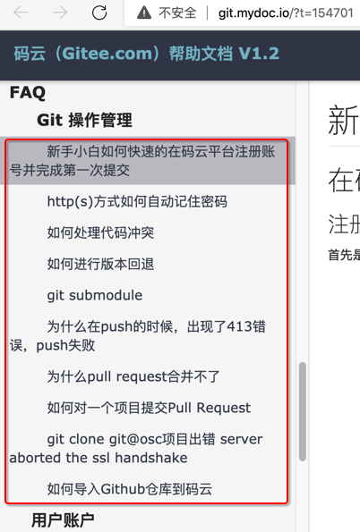

# 相关教程

* 不错的Git教程
  * 阮一峰的git教程
    * [Git远程操作详解 - 阮一峰的网络日志](http://www.ruanyifeng.com/blog/2014/06/git_remote.html)
  * FFmpeg官网的git教程
    * [Using Git to develop FFmpeg](https://www.ffmpeg.org/git-howto.html)
  * Gitee码云的git教程
    * [码云（Gitee.com）帮助文档_V1.2](http://git.mydoc.io/?t=154701)
      * 还有常见问题汇总
        * 
* 其他一些git相关资料
  * [Git教程 - 廖雪峰的官方网站](https://www.liaoxuefeng.com/wiki/0013739516305929606dd18361248578c67b8067c8c017b000)
  * [git - the simple guide - no deep shit!](http://rogerdudler.github.io/git-guide/index.zh.html)
  * [猴子都能懂的GIT入门 | 贝格乐（Backlog）](https://backlogtool.com/git-tutorial/cn/)
  * [Pro Git（中文版）](http://git.oschina.net/progit/)
