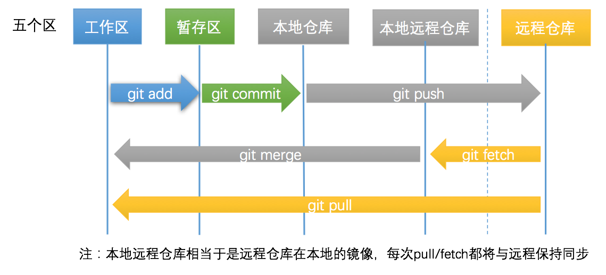
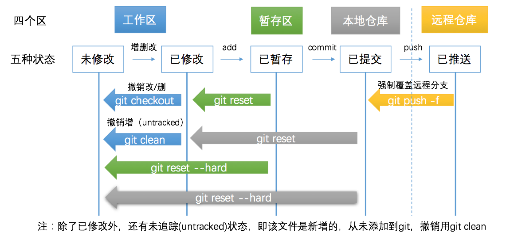

# Git基本操作

## 代码提交和同步代码

最常见的基本操作：

* 概述
  * 
* 详解
  * 最基本的
    * 创建本地git仓库
      ```bash
      git init
      ```
  * 最常见的三步：新增并上传文件
    * 添加文件
        ```bash
        git add
        ```
    * 提交
        ```bash
        git commit
        ```
    * 推送 = 上传到远端仓库
        ```bash
        git push
        ```
  * 更新文件
    * 2步
      * 下载新文件
          ```bash
          git fetch
          ```
      * 合并新文件
          ```bash
          git merge
          ```
    * 或：直接1步
      * 下载并合并
          ```bash
          git pull
          ```

## 代码撤销和撤销同步

相对高级一些的操作：



## 查看远程仓库url地址

```bash
git remote -v
```
## 其他操作

* 其他
  * 常见操作
    * 暂存本地更改（往往在`git pull`之前）
      ```bash
      git stash
      ```
    * 恢复本地更改（往往在`git pull`之后）
      ```bash
      git stash pop
      ```
  * 高级操作
    * rebase
    ```bash
    git rebase
    ```
    * 分支
    ```bash
    git branch
    git -b
    ```

### 要安装github中具体某个分支

格式：`git_address#branch_name`

举例：

```bash
npm install git://github.com/matthieuprat/react-tappable.git#fix-is-mounted-deprecation --save
```
