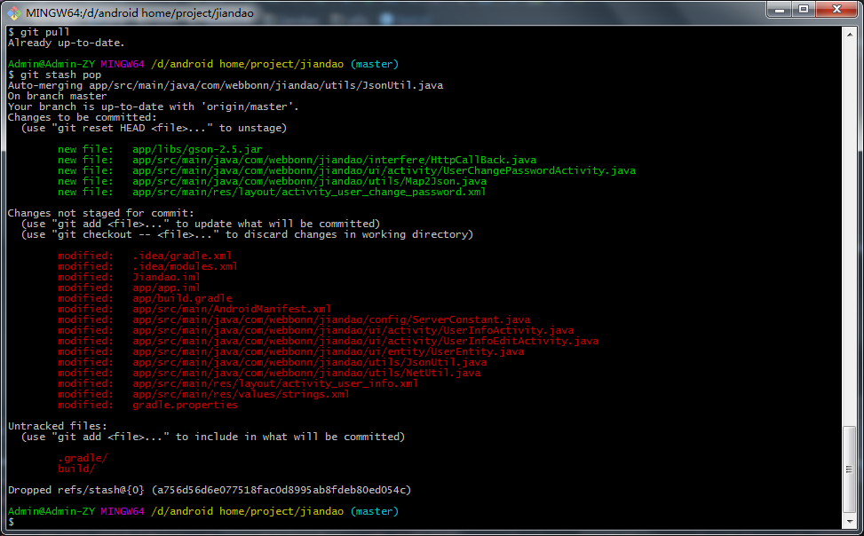

# changes would overwritten by merge

**现象**：`git pull`出错：

```bash
xxxMacBook-Pro:xxx minglong$ git pull
Username for ‘http://git.oschina.net’: xxx@qq.com
Password for ‘http://xxx@qq.com@git.oschina.net’:
remote: Counting objects: 25, done.
remote: Compressing objects: 100% (25/25), done.
remote: Total 25 (delta 15), reused 0 (delta 0)
Unpacking objects: 100% (25/25), done.
From http://git.oschina.net/xxx/xxx
   dec7330..c99180f  master     -> origin/master
   f0edd68..c99180f  remote_push -> origin/remote_push
* [new tag]         remote_push -> remote_push
Updating dec7330..c99180f
error: Your local changes to the following files would be overwritten by merge:
        JianDao/JianDao/Constants.swift
Please, commit your changes or stash them before you can merge.
Aborting
```

**原因**：本地有更新，但是没提交。而pull下载并合并，会把本地改动覆盖掉。

**解决办法**：把本地的暂存起来，再去pull更新并合并，再把暂存的恢复出来。

**操作步骤**：

```bash
git stash

git pull

git stash pop
```

---

补充：

另外也遇到一个类似情况，但是处理方式是：

扔掉另外2个冲突的，但是无用的文件：

```bash
git checkout — file_you_want_throw_away
```

再去`git stash pop`即可：



