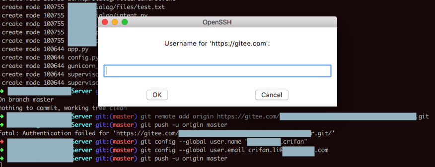
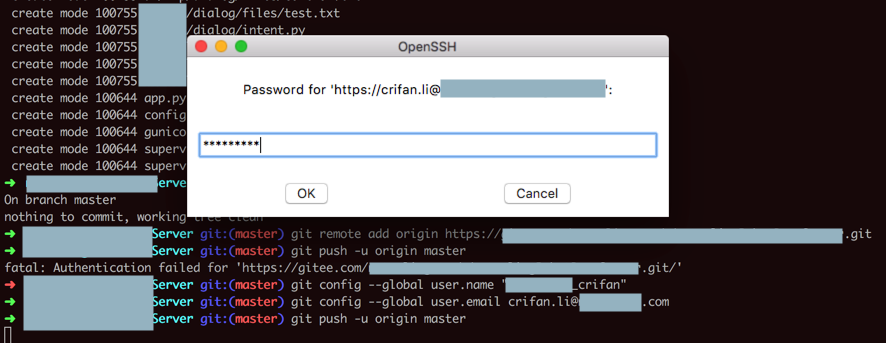
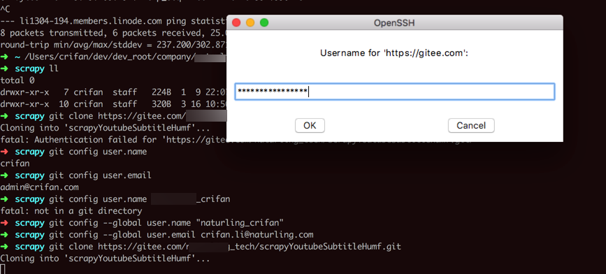

# fatal Authentication failed for

**现象**：`git clone`或`git push`报错：

```bash
remote: You do not have permission to pull from the repository via HTTPS
fatal: Authentication failed for 'https://gitee.com/crifan/xxx.git/'
```

**原因**：（密码已更新导致了）之前本地保存的账号和密码不对（失效了）

**解决办法**：更换（更新）对应账号和密码

**操作步骤**：

```bash
git config –global user.name your_account_name
git config –global user.email your_email_address
```

**举例**

```bash
git config --global user.name crifan
git config --global user.email admin@crifan.com
```

然后再去

```bash
git clone
git push
```

等操作，即可弹框分别让你输入用户名和密码：

* 用户名
  * 
* 密码
  * 

根据提示去输入，即可。

> #### warning:: Mac的iTerm中可能看不到用户名和密码输入框
> 
> 在Mac中iTerm的终端时，此处是看不到弹框的，需要
> 
> 手动用 快捷键 **Command + `** 去切换，才能看到（OpenSSH的）弹框窗口
> 
> 
> 
> 否则，看不到弹框时，就会让人很懵，不知道怎么回事。
