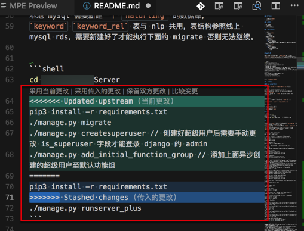

# Updated upstream Stashed changes

在

* 本地：已有文件改动
* 远程git仓库：也有文件改动
* 且本地改动和远程git仓库中的改动，是同一个文件，同一个（附近的）位置

的情况下，去

```bash
git pull
```

等操作时，往往会遇到：

```bash
<<<<<<< Updated upstream
xxx
=======
yyy
>>>>>>> Stashed changes
```

表示：出现冲突了

需要：自己根据实际情况去合并内容，取舍某个版本，或者合并2部分的内容，为最新的内容等等。

举例说明：



文件内容会变成：

```markdown
cd XxxCmsServer
<<<<<<< Updated upstream
pip3 install -r requirements.txt
./manage.py migrate
./manage.py createsuperuser // 创建好超级用户后需要手动更改 is_superuser 字段才能登录 django 的 admin
./manage.py add_initial_function_group // 添加上面异步创建的超级用户至默认功能组
=======
pip3 install -r requirements.txt
>>>>>>> Stashed changes
./manage.py runserver_plus
```

此处：由于本地内容更新，且已包含服务器=远端git仓库中的内容，则可以：

采用本地内容

则具体操作是：点击 `采用当前更改`，即可。

合并后的内容就是：

```markdown
pip3 install -r requirements.txt
./manage.py migrate
./manage.py createsuperuser // 创建好超级用户后需要手动更改 is_superuser 字段才能登录 django 的 admin
./manage.py add_initial_function_group // 添加上面异步创建的超级用户至默认功能组
```
