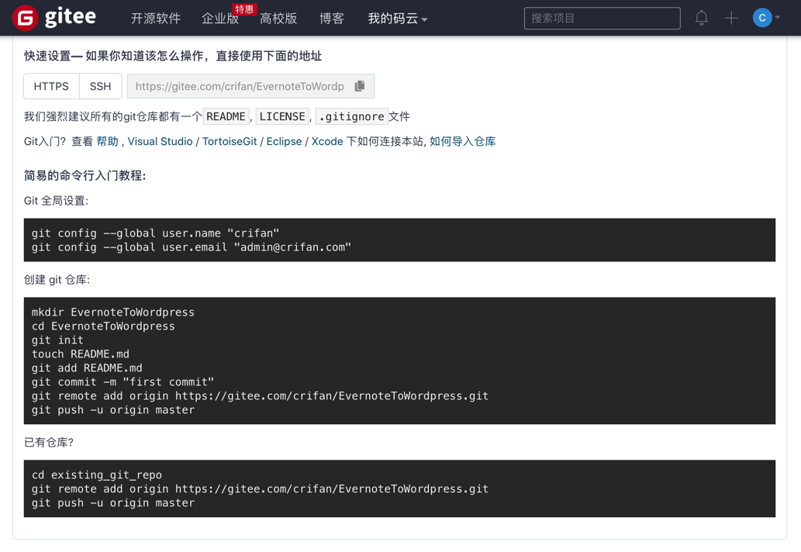

# 新建仓库后如何操作

新建git项目后，如何操作

简易的命令行入门教程:

Git 全局设置:

```bash
git config --global user.name "CrifanLi"
git config --global user.email "crifan.li@xxx.com"
```

创建 git 仓库：

```bash
mkdir see_empty_project_git
cd see_empty_project_git
git init
touch README.md
git add README.md
git commit -m "first commit"
git remote add origin https://gitee.com/naturling_crifan/see_empty_project_git.git
git push -u origin master
```

已有项目 = 把当前代码加到已有项目

```bash
cd existing_git_repo
git remote add origin https://gitee.com/naturling_crifan/see_empty_project_git.git
git push -u origin master
```

## 举例：EvernoteToWordpress

[crifan/EvernoteToWordpress](https://gitee.com/crifan/EvernoteToWordpress)



```bash
简易的命令行入门教程:
Git 全局设置:
git config --global user.name "crifan"
git config --global user.email "admin@crifan.com"

创建 git 仓库:
mkdir EvernoteToWordpress
cd EvernoteToWordpress
git init
touch README.md
git add README.md
git commit -m "first commit"
git remote add origin https://gitee.com/crifan/EvernoteToWordpress.git
git push -u origin master

已有仓库?
cd existing_git_repo
git remote add origin https://gitee.com/crifan/EvernoteToWordpress.git
git push -u origin master
```
