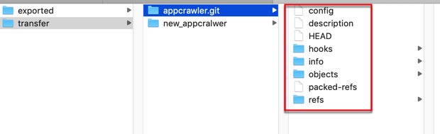

# 迁移仓库且保留历史记录

之前遇到过个需求：整体迁移git仓库，且保留所有历史commit提交记录

步骤是：

```bash
git clone --mirror old-repo-url new-repo

cd new-repo
git remote remove origin

git remote add origin new-repo-url

git push --all
git push --tags
```

**说明**：

此处的：

```bash
git clone --mirror <url to ORI repo> temp-dir
```

等价于：

```bash
git clone <url to ORI repo> temp-dir

git branch -a

git checkout branch-name

git fetch --tags

git tag
git branch -a
```

**后记**：确认和验证新仓库代码是正常的

```bash
cd ..
rm -rf new-repo
git clone new-repo-url new-repo
```

其中：把new-repo-url和 new-repo 换成你自己的仓库

## 举例：迁移appcrawler

此处自己的操作：

### 以镜像方式下载复制代码

```bash
git clone --mirror http://xxx.xxx.com:yyy/data/data_limao/appcrawler.git appcrawler
```

> #### warning:: 下载后是git相关文件，而不是源码
>
> 此处下载后，本地文件夹中看到的内容，不是源码，而是git的一些文件：
```bash
cd appcrawler.git
limao@xxx  ~/dev/xxx/gitlab/transfer/appcrawler.git   master  ll
total 32
-rw-r--r--   1 limao  CORP\Domain Users    23B  7 15 15:23 HEAD
-rw-r--r--   1 limao  CORP\Domain Users   238B  7 15 15:23 config
-rw-r--r--   1 limao  CORP\Domain Users    73B  7 15 15:23 description
drwxr-xr-x  13 limao  CORP\Domain Users   416B  7 15 15:23 hooks
drwxr-xr-x   3 limao  CORP\Domain Users    96B  7 15 15:23 info
drwxr-xr-x   4 limao  CORP\Domain Users   128B  7 15 15:23 objects
-rw-r--r--   1 limao  CORP\Domain Users   105B  7 15 15:23 packed-refs
drwxr-xr-x   4 limao  CORP\Domain Users   128B  7 15 15:23 refs
```
> 
> 
> -> 不要和我之前一样误以为是操作失败了。这是正常的，期望的结果，不是出错了。

### 删除本地的远端的分支

```bash
cd appcrawler
git remote remove origin
```

其中会有提示，意思好像是需要你主动删除原有分支？总之可以忽略不管。

注：

```bash
git remote remove origin
```
的另一种写法：
```bash
git remote rm origin
```

### 添加远端地址为新仓库

```bash
git remote add origin http://xxx.corp.com:xxx/data_limao/appcrawler.git
```

### 提交上传所有代码和标签

* 上传所有代码：
    ```bash
    git push --all
    ```
  * 或
    * 先
        ```bash
        git push origin --all
        ```
    * 和  所有标签：
      ```bash
      git push --tags
      ```

