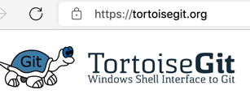

# git的IDE

* `编辑器`或`IDE`本身集成Git功能
  * `VSCode`
* 专门的Git的客户端
  * Mac
    * `SourceTree`
  * Win
    * `TortoiseGit`
      * 官网：https://tortoisegit.org/
        * 
      * 一句话描述：Windows Shell Interface to Git
        * The Power of Git – in a Windows Shell
