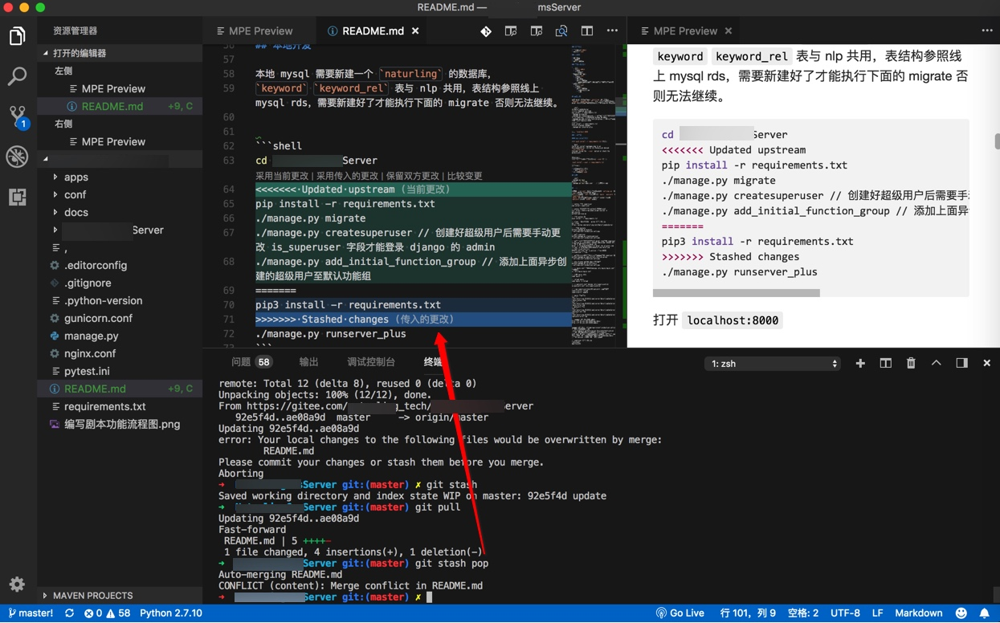

# VSCode

VSCode本身自带功能，就默认支持git，且支持的非常好。

## Conflict冲突

当（比如`git stash pop`后）出现conflict冲突后，会高亮显示冲突的地方：

且可以直接点击按钮实现对应效果：

* 采用当前更改
  * 即，使用：`Updated upstream`
* 采用传入的更改
  * 即，使用：`Stashed changes`
* 保留双方更改
  * 即，两者都保留
* 比较更改
  * 点击后可以比较内容差异

-> 方便你合并想要的内容，而不会导致内容丢失。
