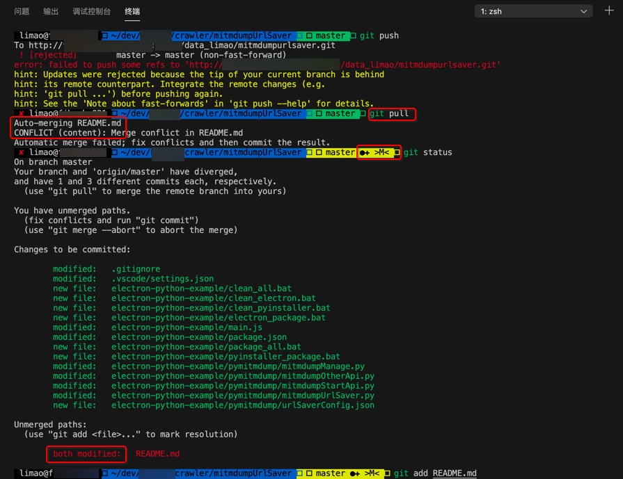

# 相关支持

## zsh中对于git支持的很好

`zsh`在安装了插件后，对于`git`支持的很好

甚至包括：当`auto-merge`出现`conflict`冲突时，`git status`的前缀都自动显示出 `>M<：`

```bash
 master ●✚ >M<  git status
```



表示有内容需要合并（后才能再去提交）

此处表明，细节支持的很到位。

