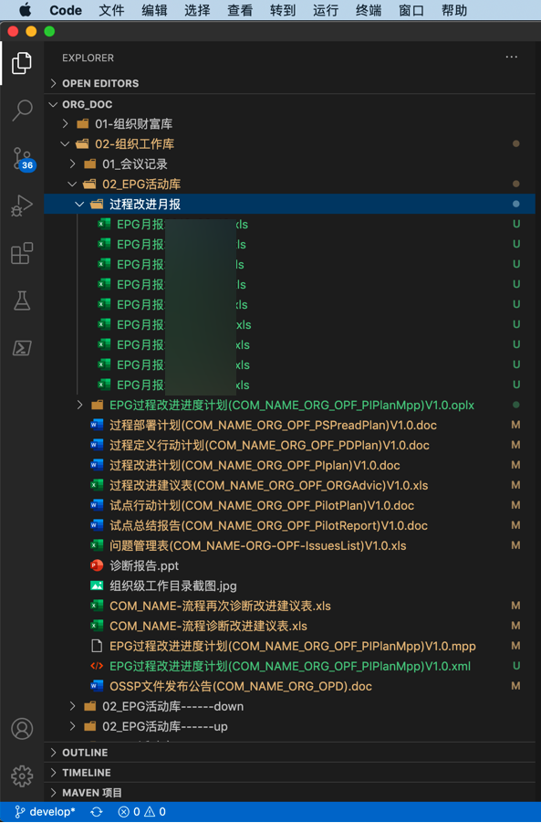
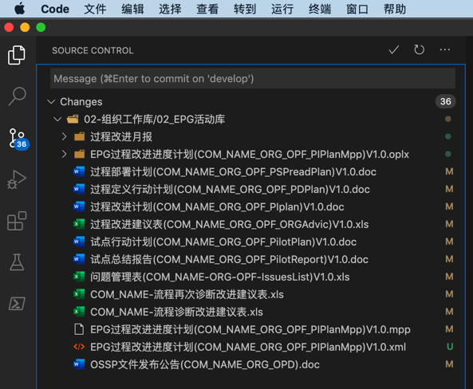
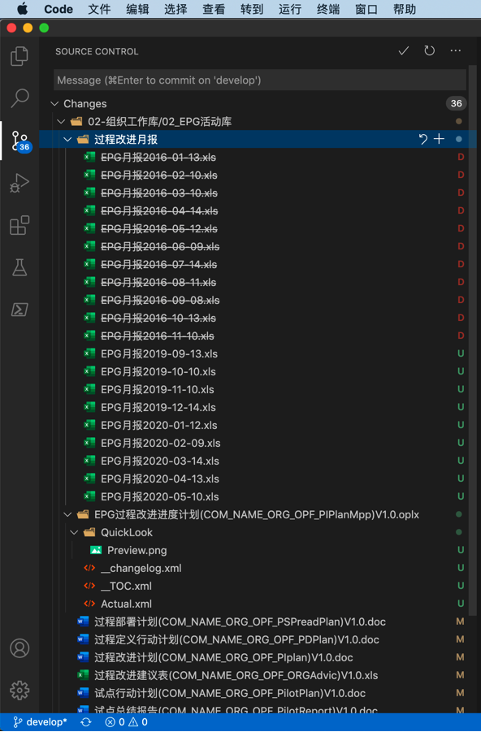
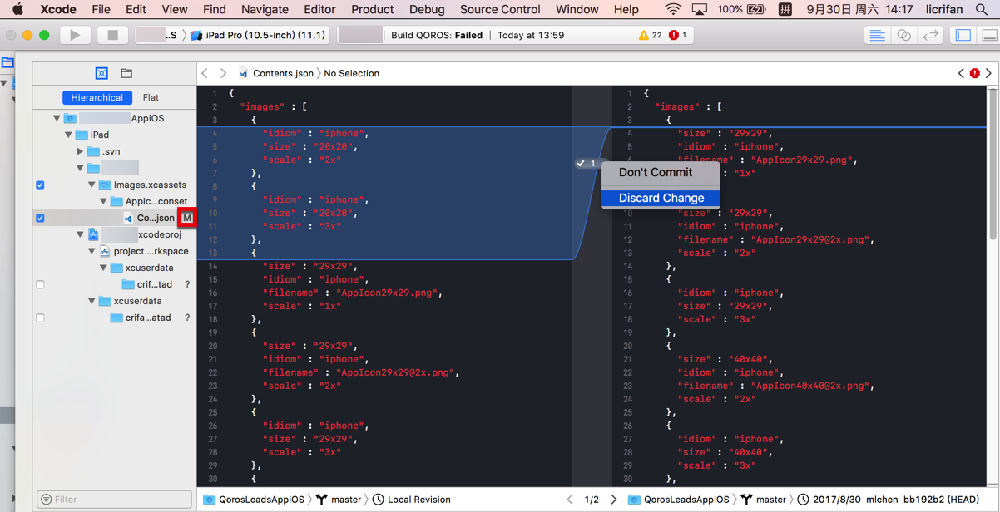
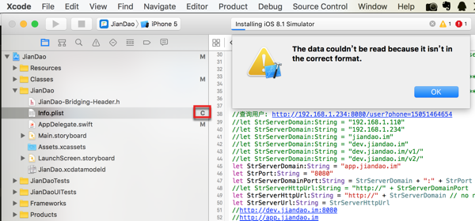
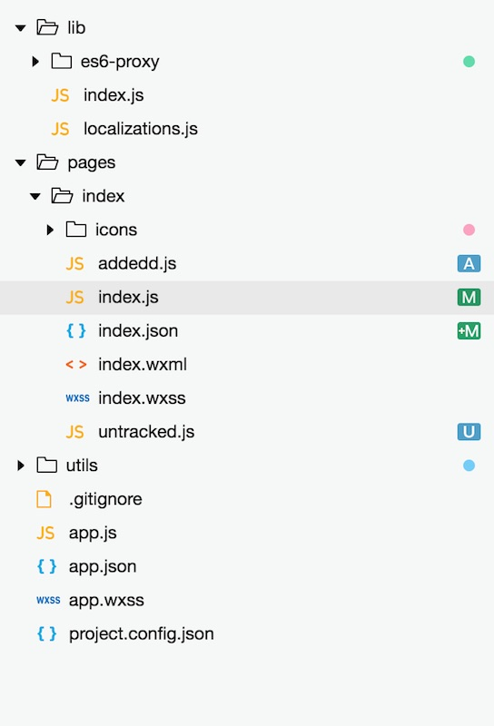
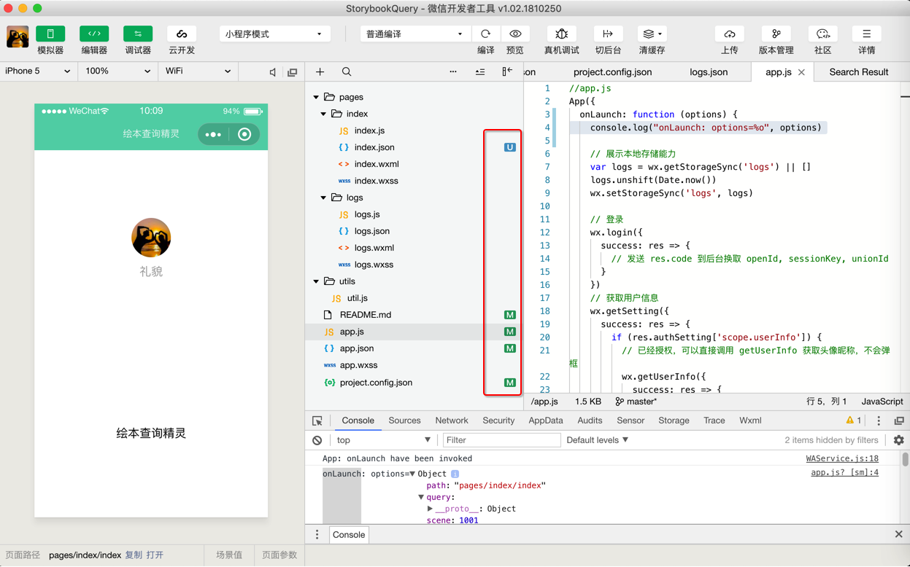
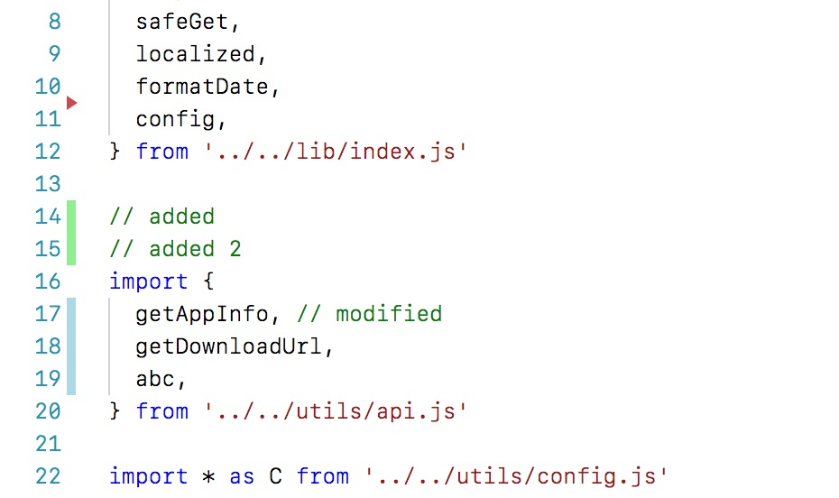

# 相关支持

## git中文件的不同状态

git中，文件被改动后，会有多种不同的状态，往往用固定的字母去表示：

| 图标 | 含义 |
| --- | --- |
| U   | 文件未追踪（**U**ntracked） |
| A   | 新文件（**A**dded, Staged） |
| M   | 文件有修改（**M**odified） |
| +M   | 文件有修改（**M**odified, Staged） |
| C   | 文件有冲突（**C**onflict） |
| D   | 文件被删除（**D**eleted） |

对应的不同的支持git的工具中的效果：

## VSCode

* U=文件未追踪
  * 

切换到git视图，且排序是按照目录树 的效果是：

* M = 文件有修改
  * 

以及：

* D = 文件被删除
  * 

## XCode

* M=文件有修改
  * 
* C=文件有冲突
  * 

## 微信小程序开发工具

官网举例：

* `A=新文件` + `M=有修改` + `+M=有修改且暂存` + `U=未追踪`
  * 

自己实例：

* `M=有修改` + `U=未追踪`
  * 

小程序中对应颜色表示额外信息：

| 图标 | 含义 |
| --- | --- |
| 小红点   | 目录下至少存在一个**删除**状态的文件 |
| 小橙点   | 目录下至少存在一个**冲突**状态的文件 |
| 小蓝点   | 目录下至少存在一个**未追踪**状态的文件 |
| 小绿点   | 目录下至少存在一个**修改**状态的文件 |

### 小程序代码

对应的小程序的代码中的带颜色的线条，表示对应的含义：

| 样式 | 含义 |
| --- | --- |
| 蓝色线条 | 此处的代码有**变动** |
| 绿色线条 | 此处的代码是**新增**的 |
| 红色三角箭头 | 此处有代码**被删除** |

举例：



## zsh

`zsh`在安装了插件后，对于`git`支持的很好

甚至包括：当`auto-merge`出现`conflict`冲突时，`git status`的前缀都自动显示出 `>M<：`

```bash
 master ●✚ >M<  git status
```


表示有内容需要合并（后才能再去提交）

此处表明，细节支持的很到位。
