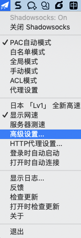
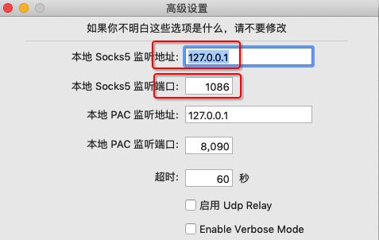
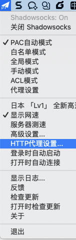
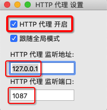

# 给git加代理

有时候由于科学上网、下载速度慢等原因，需要去给git添加代理实现加速。

此处和Git的代理相关的操作有：

* 查看代理
* 设置代理=添加代理
* 取消代理

下面详细解释如何操作：

注：假如要设置的代理地址是：`socks5://127.0.0.1:1086`

* 查看（当前是否使用）代理
  * 查看本地代理
    * 方式
      * 命令行
        ```bash
        git config http.proxy
        ```
      * 配置文件方式
        ```bash
        cat .git/config
        ```
    * 结果
      * 可以看到：是否有`http`部分，`http`中是否有`proxy`，`proxy`是否为空
  * 查看全局代理
    * 方式
      * 命令行
        ```bash
        git config --global http.proxy
        ```
      * 配置文件方式
        ```bash
        cat ~/.gitconfig
        ```
    * 结果
      * 可以看到：是否有`http`部分，`http`中是否有`proxy`，`proxy`是否为空
* 设置（添加）代理
  * 设置本地代理
    * 方式
      * 命令行
        ```bash
        git config http.proxy socks5://127.0.0.1:1086
        ```
      * 配置文件
        ```bash
        vi .git/config
        ```
        * 加上：`http`的`proxy`的值是`socks5://127.0.0.1:1086`
          ```ini
          [http]
            proxy = socks5://127.0.0.1:1086
          ```
  * 设置全局代理
    * 方式
      * 命令行
        ```bash
        git config --global http.proxy socks5://127.0.0.1:1086
        ```
      * 配置文件
        ```bash
        vi ~/.gitconfig
        ```
        * 加上：`http`的`proxy`的值是`socks5://127.0.0.1:1086`
          ```ini
          [http]
            proxy = socks5://127.0.0.1:1086
          ```
* 取消代理
  * 取消本地代理
    * 方式
      * 命令行
        ```bash
        git config --unset http.proxy
        ```
      * 配置文件
        ```bash
        vi .git/config
        ```
        * 方式1：去掉`http`的`proxy`
          ```ini
          [http]
          ```
        * 方式2：设置`proxy`值是**空**
          ```ini
          [http]
            proxy =
          ```
  * 取消全局代理
    * 方式
      * 命令行
        ```bash
        git config --global --unset http.proxy
        ```
      * 配置文件
        ```bash
        vi ~/.gitconfig
        ```
        * 方式1：去掉`http`的`proxy`
          ```ini
          [http]
          ```
        * 方式2：设置`proxy`值是**空**
          ```ini
          [http]
            proxy =
          ```

## 背景知识

### 关于自己电脑中可以使用的代理

本地电脑中可以使用的代理，往往是像我一样，开了科学上网的工具（`SS`/`SSR`/`Trojan`等），所以有了：

* （默认开启的）**Socks5代理**
  * 举例：`socks5://127.0.0.1:1086`
    * 自己`Mac`中的`ShadowsocksX-NG`的`R`版`1.4.4-R8 (1)`
      * `高级设置`->`本地Sock5监听` 地址和端口，分别是`127.0.0.1`和`1086`
        * 
        * 
      * 所以**Socks5的代理地址**就是：
        * `socks5://127.0.0.1:1086`
* （默认没开启，要自己手动开启的）**http代理**
  * 举例：`http://127.0.0.1:1087`
    * 自己`Mac`中的`ShadowsocksX-NG`的`R`版`1.4.4-R8 (1)`
      * `HTTP代理设置`->**勾选**：`HTTP代理开启`，以及HTTP代理监听地址和端口，分别是`127.0.0.1`和`1087`
        * 
        * 
      * 所以**http的代理地址**就是：
        * `http://127.0.0.1:1087`

## 注意事项

### git的代理没有`https`的proxy，只有`http`的proxy

后经[git官网](https://git-scm.com/docs/git-config)证实：

* 结论：**只有**`http`的proxy，**没有**`https`的proxy
* 解释
  * （很多人）以为
    * `http.proxy`只针对 http://xxx 的http的网址
    * `https.proxy`只针对 https://xxx 的https的网址
      * 比如常见的
        * https://github.com/xxx
        * https://gitee.com/xxx
  * 其实：此处`http.proxy`中的
    * `http`：指的是HTTP**协议**，包括http和https的网址
    * `proxy`：指的是**代理**，都加上代理
  * 所以：
    * 即使是（ https://github.com 、https://gitee.com 等）https的git的url地址，也是http的proxy，而不是https的proxy
    * **没有**
      * 命令行中的写法
        ```bash
        git config https.proxy
        ```
      * 配置文件
        * 包括
          * 本地的：`.git/config`
          * 全局的：`~/.gitconfig`
        * 中的写法
          ```ini
          [https]
            proxy = xxx
          ```
    * **只有**
      * 命令行中的写法：
        ```bash
        git config http.proxy 
        ```
      * 配置文件
        * 包括
          * 本地的：`.git/config`
          * 全局的：`~/.gitconfig`
        * 中的写法
          ```ini
          [http]
            proxy = xxx
          ```

## 特殊设置

### 单独针对某些git仓库=url 单独启用代理 或者 单独不用代理

#### 举例：只给GitHub启用代理，其他不用代理

注：GitHub的地址是： https://github.com

* 命令行方式
  * 本地代理
    ```bash
    git config http.https://github.com.proxy socks5://127.0.0.1:1086
    ```
  * 全局代理
    ```bash
    git config --global http.https://github.com.proxy socks5://127.0.0.1:1086
    ```
* 配置文件方式
  * 编辑配置文件
    * 本地
      ```bash
      vi .git/config
      ```
    * 全局
      ```bash
      vi ~/.gitconfig
      ```
  * 文件内容
    ```ini
    [http "https://github.com"]
      proxy = socks5://127.0.0.1:1086
    ```

#### 举例：其他全部启用代理（包括github），而gitee不用代理

* 命令行方式
  * 本地
    ```bash
    git config http.proxy socks5://127.0.0.1:1086
    git config http.https://gitee.com.proxy ''
    ```
  * 全局
    ```bash
    git config --global http.proxy socks5://127.0.0.1:1086
    git config --global http.https://gitee.com.proxy ''
    ```
* 配置文件方式
  * 编辑配置文件
    * 本地
      ```bash
      vi .git/config
      ```
    * 全局
      ```bash
      vi ~/.gitconfig
      ```
  * 文件内容
    ```ini
    [http]
      proxy = socks5://127.0.0.1:1086
    [http "https://gitee.com/"]
      proxy =
    ```

