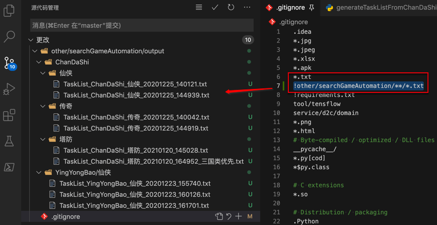
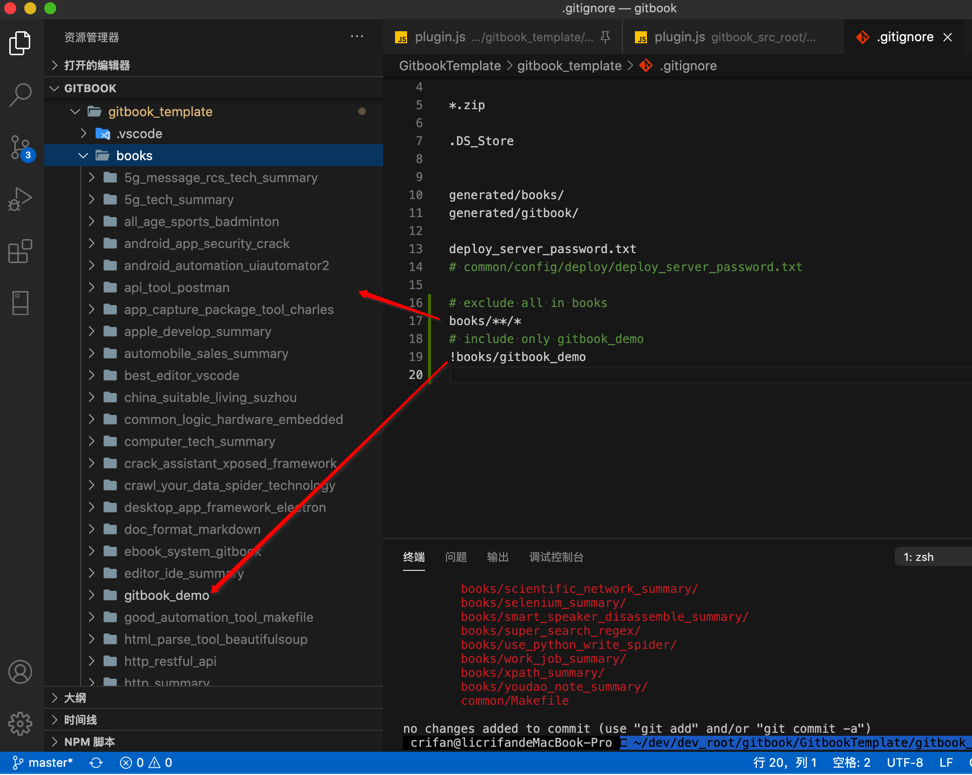
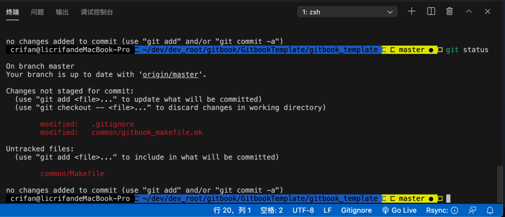
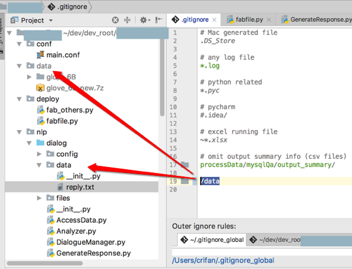
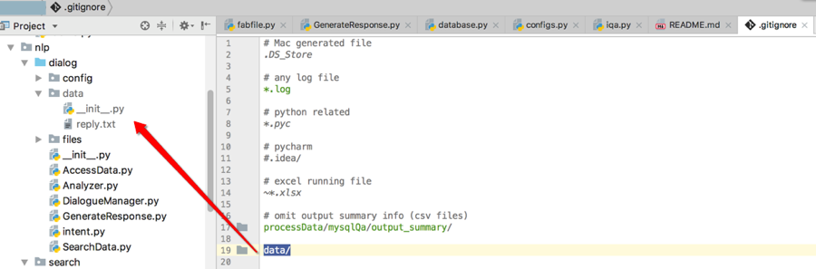
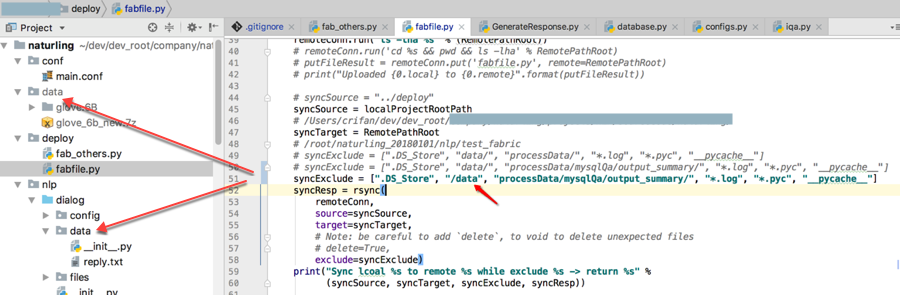

# .gitignore

* `.gitignore`
  * 是什么：普通的文本文件，是git中的一个配置文件
  * 作用：描述了`git`系统需要排除`ignore`哪些文件
  * 位置：
    * 最常见：git仓库根目录
      * 也可以：放在git仓库的任何子目录中

## 常见问题

### 排除掉其他所有，但只包含某个子目录中内容

* 举例1
  * 希望：忽略掉所有子目录中，所有txt文件
    * 但是不排除，即包含`other/searchGameAutomation`目录中的所有txt文件
  * `.gitignore`的写法
    ```git
    *.txt
    !other/searchGameAutomation/**/*.txt
    ```
  * 效果
    * 
* 举例2
  * 希望：排除掉books下面所有的子文件夹
    * 但是只保留books/gitbook_demo
  * `.gitignore`的写法
    ```git
    # exclude all in books
    books/**/*
    # include only single subfolder: gitbook_demo
    !books/gitbook_demo
    ```
  * 效果
    * 
    * 相应的`git status`就没了那么多books了
      * 

### 排除项目根目录下data文件夹而保留某子文件夹中data文件夹

`.gitigonre`的配置：

```git
/data
```

即可实现：

* 只**排除**掉项目**根目录**下的data文件夹
  * 但**保留**其他**子文件夹**中的data目录

效果：



> #### warning:: 不要误写成`data/`
> 
> 如果误写成`data/`，则会：
> 
> * 排除掉所有的 data文件夹
>   * 除了会排除掉项目根目录下的data文件夹
>   * 也会排除掉其他子文件夹中的data目录
>     * 

另外：

> #### info:: fabric中也是类似的逻辑
> 
> `fabric`中利用`patchwork`的`rsync`去同步，在添加`exclude`参数，要排除掉的文件或文件夹时，语法也是类似的：
> 
> 如果用`/data`，则也会导致子文件中的data目录被排除掉
> 
> 
